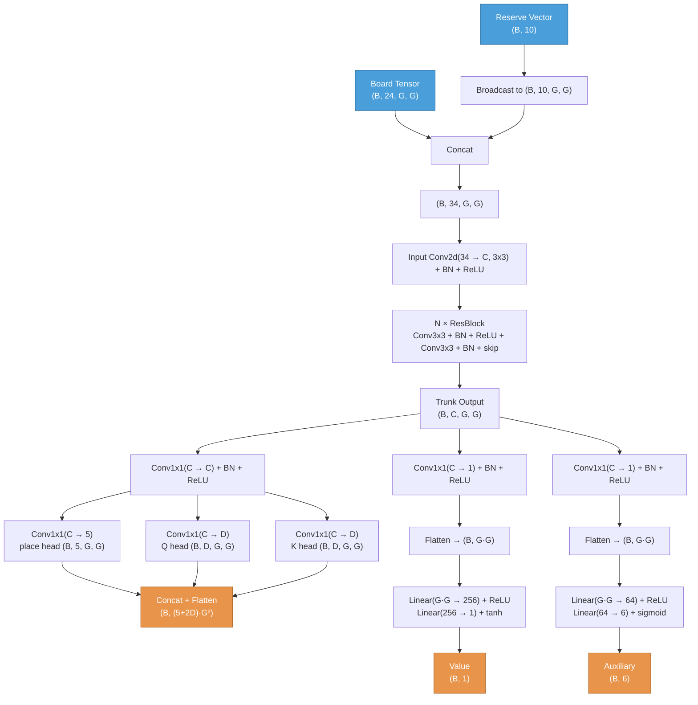

# HiveNet Architecture

## Data Flow



## Input

Tensor dimensions use `(B, ...)` notation where B = batch size.

### Board tensor: `(B, 24, G, G)`
24 channels on a GxG grid (default G=23, configurable, must be odd). Flat-top axial hex coordinates centered on the grid. All channels are current-player-relative. Piece channels use type identity (no per-individual numbering).

| Channels | Content |
|----------|---------|
| 0-4 | Current player's pieces at base level (0=Queen, 1=Spider, 2=Beetle, 3=Grasshopper, 4=Ant) |
| 5-9 | Opponent's pieces at base level (same type ordering) |
| 10-13 | Current player's stacker at depths 1-4 (binary; generic, not per-individual) |
| 14-17 | Opponent's stacker at depths 1-4 (same scheme) |
| 18 | Hive edge (binary: 1 for empty cells adjacent to at least one occupied cell) |
| 19 | Distance to current player's queen (hex distance normalized by grid_size; 1.0 if queen not placed) |
| 20 | Distance to opponent's queen (same normalization) |
| 21 | Adjacent to current player's queen (binary: 1 if cell neighbors the queen) |
| 22 | Adjacent to opponent's queen (binary) |
| 23 | Pinned piece (binary: 1 if occupied and removing the piece would split the hive) |

### Reserve vector: `(B, 10)`
Current-player-relative piece counts remaining in hand.

| Index | Content |
|-------|---------|
| 0-4 | Current player's reserve (Queen, Spider, Beetle, Grasshopper, Ant) |
| 5-9 | Opponent's reserve (same order) |

## Trunk

Reserve vector is broadcast spatially and concatenated with the board tensor before the trunk:
`(B, 24, G, G)` + `(B, 10, G, G)` → `(B, 34, G, G)`

```
Input Conv2d(34 -> C, 3x3, pad=1) + BN + ReLU
  |
N x ResBlock:
  Conv2d(C -> C, 3x3, pad=1) + BN + ReLU
  Conv2d(C -> C, 3x3, pad=1) + BN
  + skip connection + ReLU
```
Output: `(B, C, G, G)`

Default config: **C=128, N=10** (10 residual blocks, 128 channels)

## Policy Head (bilinear Q·K)

Three output heads off a shared conv+BN layer, concatenated into a flat vector:

```
Conv2d(C -> C, 1x1) + BN + ReLU           -> (B, C, G, G)
  ├── Conv2d(C -> 5, 1x1)  place head     -> (B, 5, G, G)   [placement: piece_type × dest]
  ├── Conv2d(C -> D, 1x1)  Q head         -> (B, D, G, G)   [movement source embeddings]
  └── Conv2d(C -> D, 1x1)  K head         -> (B, D, G, G)   [movement dest embeddings]
Concat + Flatten                          -> (B, (5+2D)*G²)
```

**D = BILINEAR_DIM = 8** (embedding dimension for Q·K movement head)

### Policy layout (flat vector of size (5+2D)·G²)

| Range | Head | Content |
|-------|------|---------|
| `[0 .. 5·G²)` | place | Placement logits: `type_idx * G² + dest_cell` |
| `[5·G² .. (5+D)·G²)` | Q | Source embeddings: `d * G² + src_cell` for d in [0, D) |
| `[(5+D)·G² .. (5+2D)·G²)` | K | Dest embeddings: `d * G² + dst_cell` for d in [0, D) |

Default policy size (D=8, G=17): 21 × 17 × 17 = **6,069**

### MCTS prior computation
- **Placement**(type, dest): `prior = place_logits[type * G² + dest_cell]`
- **Movement**(src, dest): `prior = Q[src] · K[dst] / sqrt(D)`
  where `Q[src] = (policy[5·G² + 0·G² + src], ..., policy[5·G² + (D-1)·G² + src])` — a D-dim vector.

The bilinear formulation allows arbitrary rank-D joint distributions over (src, dst) pairs, eliminating the rank-1 independence assumption of the old factorized head.

### Policy loss
- **Placement**: soft cross-entropy over the 5·G² placement logits.
- **Movement**: soft cross-entropy over bilinear scores for all legal (src, dst) pairs. Training targets are sparse joint visit-count distributions — **not** marginalized into separate src/dst slices. Positions with no movement (pure placement turn) contribute zero movement loss.

## Value Head

Operates directly on the trunk output (reserve info already in trunk via input).

```
Conv2d(C -> 1, 1x1) + BN + ReLU           -> (B, 1, G, G)
Flatten                                   -> (B, G*G)
Linear(G*G -> 256) + ReLU                 -> (B, 256)
Linear(256 -> 1) + tanh                   -> (B, 1)
```
Output range: `[-1, 1]`

### Value loss
MSE: `(predicted - target)^2`

## Auxiliary Head
Separate pathway off the trunk (not shared with value head). Predicts per-position game metrics for both players.

```
Conv2d(C -> 1, 1x1) + BN + ReLU           -> (B, 1, G, G)
Flatten                                   -> (B, G*G)
Linear(G*G -> 64) + ReLU                  -> (B, 64)
Linear(64 -> 6) + sigmoid                 -> (B, 6)
```
Output range: `[0, 1]` per output.

| Output | Content | Computation |
|--------|---------|-------------|
| 0 | Current player queen danger | neighbors/6 + beetle-on-top bonus |
| 1 | Opponent queen danger | neighbors/6 + beetle-on-top bonus |
| 2 | Current player queen escape | legal slide destinations / 6 |
| 3 | Opponent queen escape | legal slide destinations / 6 |
| 4 | Current player mobility | fraction of pieces with >= 1 legal move |
| 5 | Opponent mobility | fraction of pieces with >= 1 legal move |

### Auxiliary loss
MSE, always active (not masked). Provides gradient signal on every position.

## Total Loss
```
loss = policy_loss + value_loss + aux_loss
```

## Training Config
| Parameter | Value |
|-----------|-------|
| Optimizer | SGD + momentum 0.9 |
| Learning rate | 0.02 (constant) |
| Epochs per iteration | 1 |
| Grid size | 17 (covers all observed boardspace games, max diameter 15) |
| c_puct | 1.5 |
| Playout cap randomization | Yes (KataGo-style) |

## Parameter Count (C=128, N=10, G=17, D=8)
- Input conv: 34 × 128 × 3 × 3 = 39,168
- Per ResBlock: 2 × (128 × 128 × 3 × 3) = 294,912 → 10 blocks = 2,949,120
- BatchNorm (trunk): (128 × 2) × (10+1) = 2,816
- Policy head: Conv(128→128×1×1)=16,384 + BN(128)=256 + place(128→5)=645 + Q(128→8)=1,032 + K(128→8)=1,032 = 19,349
- Value head: 128×1×1 + 289×256 + 256×1 + BN = 128 + 73,984 + 256 + 2 = 74,370
- Aux head: 128×1×1 + 289×64 + 64×6 + BN = 128 + 18,496 + 384 + 2 = 19,010
- **Total: ~3.1M parameters**
