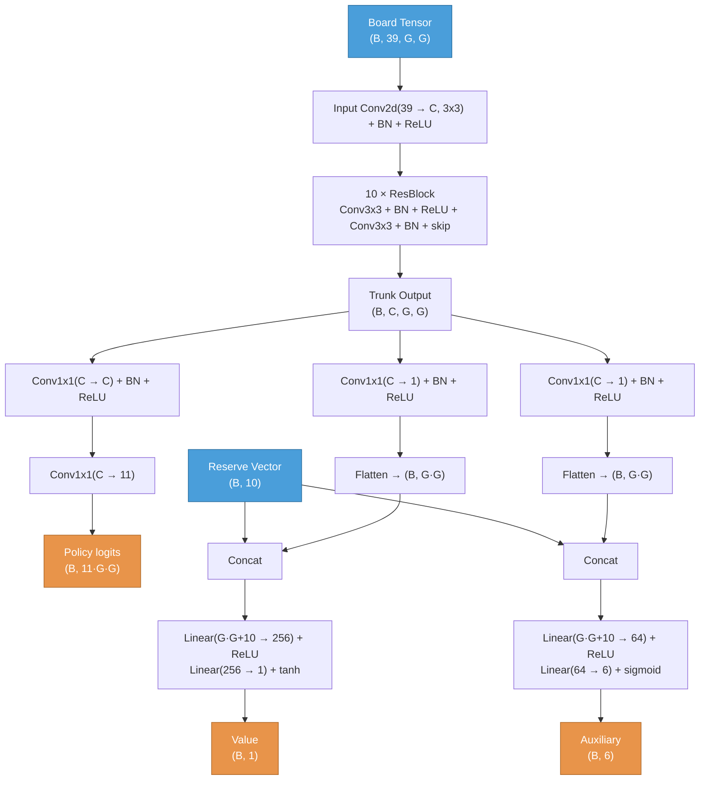

# HiveNet Architecture

## Data Flow



## Input

Tensor dimensions use `(B, ...)` notation where B = batch size.

### Board tensor: `(B, 39, G, G)`
39 channels on a GxG grid (default G=23, configurable, must be odd). Flat-top axial hex coordinates centered on the grid. All channels are current-player-relative.

| Channels | Content |
|----------|---------|
| 0-10 | Current player's pieces at base level (0=Queen, 1=Spider1, 2=Spider2, 3=Beetle1, 4=Beetle2, 5=Grasshopper1, 6=Grasshopper2, 7=Grasshopper3, 8=Ant1, 9=Ant2, 10=Ant3) |
| 11-21 | Opponent's pieces at base level (same indexing) |
| 22-37 | Stacked beetles by identity and depth: channel = 22 + player_offset(0 or 8) + (beetle_num-1)*4 + (depth-1). 4 beetles x 4 depths = 16 channels |
| 38 | Stack height at each cell |

### Reserve vector: `(B, 10)`
Current-player-relative piece counts remaining in hand.

| Index | Content |
|-------|---------|
| 0-4 | Current player's reserve (Queen, Spider, Beetle, Grasshopper, Ant) |
| 5-9 | Opponent's reserve (same order) |

## Trunk
```
Input Conv2d(39 -> C, 3x3, pad=1) + BN + ReLU
  |
N x ResBlock:
  Conv2d(C -> C, 3x3, pad=1) + BN + ReLU
  Conv2d(C -> C, 3x3, pad=1) + BN
  + skip connection + ReLU
```
Output: `(B, C, G, G)`

Default config: **C=128, N=10** (10 residual blocks, 128 channels)

## Policy Head
```
Conv2d(C -> C, 1x1) + BN + ReLU           -> (B, C, G, G)
Conv2d(C -> 11, 1x1)                      -> (B, 11, G, G)
Flatten                                   -> (B, 11*G*G)
```
11 output channels = piece index within current player (0=Queen, 1-2=Spider, 3-4=Beetle, 5-7=Grasshopper, 8-10=Ant). Destination cell stores the logit. Same channel scheme covers both placement and movement.

Default policy size: 11 x 23 x 23 = **5,819**

### Policy loss
Cross-entropy over the full policy vector.

## Value Head
```
Conv2d(C -> 1, 1x1) + BN + ReLU           -> (B, 1, G, G)
Flatten                                   -> (B, G*G)
Concat reserve                            -> (B, G*G + 10)
Linear(G*G+10 -> 256) + ReLU              -> (B, 256)
Linear(256 -> 1) + tanh                   -> (B, 1)
```
Output range: `[-1, 1]`

### Value loss
MSE: `(predicted - target)^2`

## Auxiliary Head
Separate pathway off the trunk (not shared with value head). Predicts per-position game metrics for both players.

```
Conv2d(C -> 1, 1x1) + BN + ReLU           -> (B, 1, G, G)
Flatten                                   -> (B, G*G)
Concat reserve                            -> (B, G*G + 10)
Linear(G*G+10 -> 64) + ReLU               -> (B, 64)
Linear(64 -> 6) + sigmoid                 -> (B, 6)
```
Output range: `[0, 1]` per output.

| Output | Content | Computation |
|--------|---------|-------------|
| 0 | Current player queen danger | neighbors/6 + beetle-on-top bonus |
| 1 | Opponent queen danger | neighbors/6 + beetle-on-top bonus |
| 2 | Current player queen escape | legal slide destinations / 6 |
| 3 | Opponent queen escape | legal slide destinations / 6 |
| 4 | Current player mobility | fraction of pieces with >= 1 legal move |
| 5 | Opponent mobility | fraction of pieces with >= 1 legal move |

### Auxiliary loss
MSE, always active (not masked). Provides gradient signal on every position.

## Total Loss
```
loss = policy_loss + value_loss + aux_loss
```

## Training Config
| Parameter | Value |
|-----------|-------|
| Optimizer | SGD + momentum 0.9 |
| Learning rate | 0.02 (constant) |
| Epochs per iteration | 1 |
| Grid size | 17 (covers all observed boardspace games, max diameter 15) |
| c_puct | 1.5 |
| Playout cap randomization | Yes (KataGo-style) |

## Parameter Count (C=128, N=10, G=17)
- Input conv: 39 x 128 x 3 x 3 = 44,928
- Per ResBlock: 2 x (128 x 128 x 3 x 3) = 294,912 -> 10 blocks = 2,949,120
- BatchNorm (trunk): (128 x 2) x (10+1) = 2,816
- Policy head: 128x128x1 + 128x11x1 + BN = 16,384 + 1,408 + 256 = 18,048
- Value head: 128x1x1 + (289+10)x256 + 256x1 + BN = 128 + 76,544 + 256 + 2 = 76,930
- Aux head: 128x1x1 + (289+10)x64 + 64x6 + BN = 128 + 19,136 + 384 + 2 = 19,650
- **Total: ~3.1M parameters**
