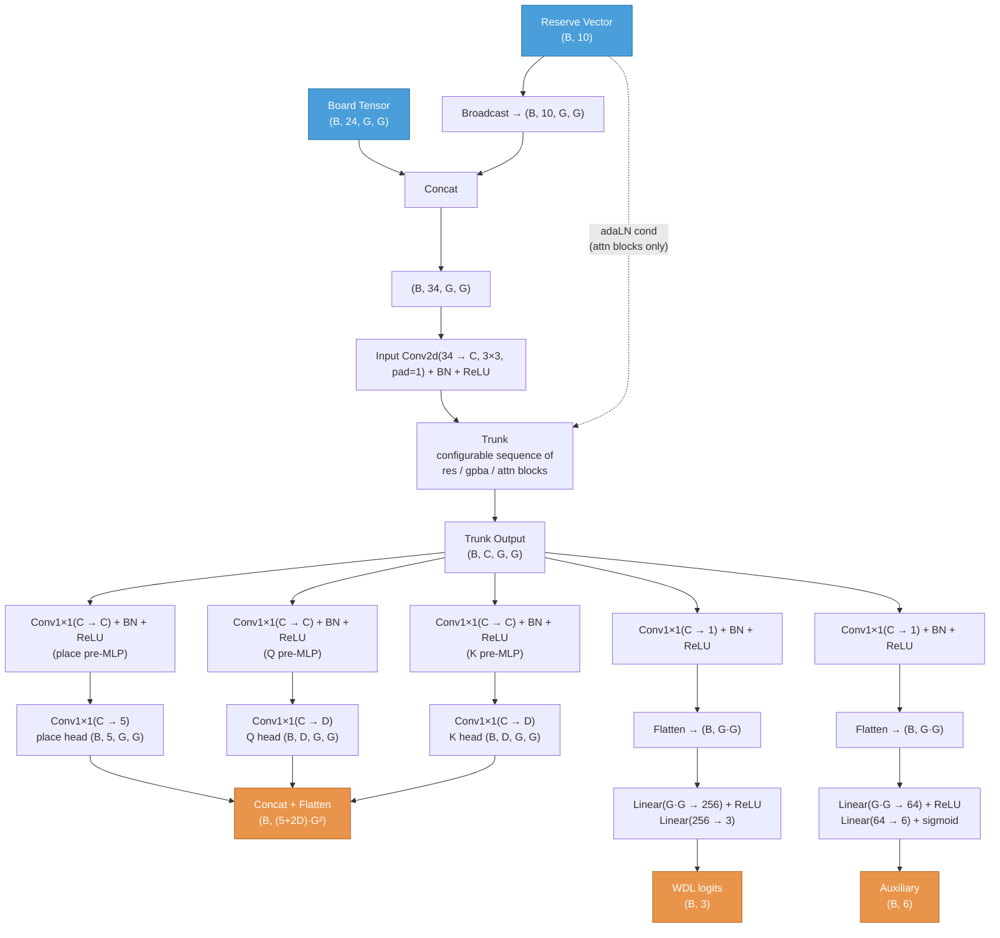

# HiveNet Architecture

## Data Flow


```mermaid
graph TD
    BT["Board Tensor<br/>(B, 24, G, G)"]:::input --> CAT["Concat"]
    RV["Reserve Vector<br/>(B, 10)"]:::input --> BC["Broadcast → (B, 10, G, G)"]
    BC --> CAT
    CAT --> INPUT["(B, 34, G, G)"]

    INPUT --> IC["Input Conv2d(34 → C, 3×3, pad=1) + BN + ReLU"]
    IC --> RB["Trunk<br/>configurable sequence of<br/>res / gpba / attn blocks"]
    RB --> TRUNK["Trunk Output<br/>(B, C, G, G)"]
    RV -.->|"adaLN cond<br/>(attn blocks only)"| RB

    TRUNK --> PCP["Conv1×1(C → C) + BN + ReLU<br/>(place pre-MLP)"]
    PCP --> PPL["Conv1×1(C → 5)<br/>place head (B, 5, G, G)"]
    TRUNK --> PCQ["Conv1×1(C → C) + BN + ReLU<br/>(Q pre-MLP)"]
    PCQ --> PQ["Conv1×1(C → D)<br/>Q head (B, D, G, G)"]
    TRUNK --> PCK["Conv1×1(C → C) + BN + ReLU<br/>(K pre-MLP)"]
    PCK --> PK["Conv1×1(C → D)<br/>K head (B, D, G, G)"]
    PPL --> PFLAT["Concat + Flatten<br/>(B, (5+2D)·G²)"]:::output
    PQ --> PFLAT
    PK --> PFLAT

    TRUNK --> VC["Conv1×1(C → 1) + BN + ReLU"]
    VC --> VF["Flatten → (B, G·G)"]
    VF --> VFC["Linear(G·G → 256) + ReLU<br/>Linear(256 → 3)"]
    VFC --> VOUT["WDL logits<br/>(B, 3)"]:::output

    TRUNK --> AC["Conv1×1(C → 1) + BN + ReLU"]
    AC --> AF["Flatten → (B, G·G)"]
    AF --> AFC["Linear(G·G → 64) + ReLU<br/>Linear(64 → 6) + sigmoid"]
    AFC --> AOUT["Auxiliary<br/>(B, 6)"]:::output

    classDef input fill:#4a9eda,stroke:#2a6fa0,color:#fff
    classDef output fill:#e8944a,stroke:#b06a2a,color:#fff
```

## Input

Tensor dimensions use `(B, ...)` notation where B = batch size. `G` is the encoding grid size (odd, configurable; the physical board is always 23×23, but the NN encoding can be smaller).

### Board tensor: `(B, 24, G, G)`
24 channels on a G×G grid. Flat-top axial hex coordinates centered on the grid. All channels are current-player-relative. Piece channels use type identity (no per-individual numbering).

| Channels | Content |
|----------|---------|
| 0-4 | Current player's pieces at base level (0=Queen, 1=Spider, 2=Beetle, 3=Grasshopper, 4=Ant) |
| 5-9 | Opponent's pieces at base level (same type ordering) |
| 10-13 | Current player's stacker at depths 1-4 (binary; generic, not per-individual) |
| 14-17 | Opponent's stacker at depths 1-4 (same scheme) |
| 18 | Hive edge (binary: 1 for empty cells adjacent to at least one occupied cell) |
| 19 | Distance to current player's queen (hex distance normalized by grid_size; 1.0 if queen not placed) |
| 20 | Distance to opponent's queen (same normalization) |
| 21 | Adjacent to current player's queen (binary: 1 if cell neighbors the queen) |
| 22 | Adjacent to opponent's queen (binary) |
| 23 | Pinned piece (binary: 1 if occupied and removing the piece would split the hive) |

### Reserve vector: `(B, 10)`
Current-player-relative piece counts remaining in hand.

| Index | Content |
|-------|---------|
| 0-4 | Current player's reserve (Queen, Spider, Beetle, Grasshopper, Ant) |
| 5-9 | Opponent's reserve (same order) |

## Trunk

The reserve vector is broadcast spatially and concatenated with the board tensor before the trunk:
`(B, 24, G, G)` + `(B, 10, G, G)` → `(B, 34, G, G)`.

```
Input Conv2d(34 → C, 3×3, pad=1, bias=False) + BN + ReLU
  |
trunk: ordered sequence of layers, each one of:
  res   — ResBlock
  gpba  — GlobalPoolBias  (KataGo-style global context)
  attn  — SpatialAttention (multi-head self-attention with adaLN-Zero,
                            conditioned on the raw reserve vector)
```
Output: `(B, C, G, G)`.

The trunk is described by a `trunk` list in the model config (each entry has a `type` and an optional `count`), e.g.:

```json
[{"type": "res", "count": 6}, {"type": "gpba"}, {"type": "res", "count": 6}, {"type": "gpba"}]
```

See the JSON files in `configs/hive/` for the maintained configurations (`small`, `medium`, `medium-attn`, `large`).

### Trunk block details

- **res** — two `Conv2d(C → C, 3×3, pad=1, bias=False) + BN`, ReLU after the first, residual add then ReLU after the second.
- **gpba** — global mean+max pool over H×W → `FC(2C → C) + ReLU` → `FC(C → C)` (zero-initialised) → broadcast as a per-channel bias added back to every spatial cell. Starts as identity; learns whole-board context without quadratic cost.
- **attn** — multi-head self-attention (default 4 heads) over the H·W spatial tokens, with a feed-forward block. Uses adaLN-Zero modulation conditioned on the reserve vector: the reserve is projected to per-channel `(scale, shift, gate)` for both the attention and FFN sub-blocks; gates are zero-initialised so the block starts as identity. This is the only place the raw reserve vector re-enters the network after the input concat.

## Policy Head (bilinear Q·K)

Three output heads, each with its own per-cell pre-MLP (`Conv1×1(C → C) + BN + ReLU`) followed by a final projection. Outputs are flattened and concatenated:

```
trunk (B, C, G, G)
  ├── Conv2d(C → C, 1×1, bias=False) + BN + ReLU → Conv2d(C → 5, 1×1)   place  → (B, 5, G, G)   [placement: piece_type × dest]
  ├── Conv2d(C → C, 1×1, bias=False) + BN + ReLU → Conv2d(C → D, 1×1)   Q      → (B, D, G, G)   [movement source embeddings]
  └── Conv2d(C → C, 1×1, bias=False) + BN + ReLU → Conv2d(C → D, 1×1)   K      → (B, D, G, G)   [movement dest embeddings]
Concat + Flatten                                                                → (B, (5+2D)·G²)
```

Each head is therefore a per-cell 2-layer MLP with hidden width `C`. Place, Q, and K want quite different per-cell features (destination quality vs source-side mover semantics vs destination-side mover semantics), so the pre-MLPs are not shared — that lets each specialise instead of fighting over a single shared projection. Cost is small: each pre-MLP adds `C²` weights (~16k at C=128).

**D = `BILINEAR_DIM` = 32** (embedding dimension for Q·K movement head; defined in [hive/encoding/move_encoder.py](../hive/encoding/move_encoder.py)).

### Policy layout (flat vector of size (5+2D)·G²)

Heads are flattened in **channel-major** order: `flat[b, c·G² + cell]`. The Rust MCTS reads with the same stride (see `search.rs` `DotProduct: q_offset + d·G² + src_cell`).

| Range | Head | Content |
|-------|------|---------|
| `[0 .. 5·G²)` | place | Placement logits: `type_idx · G² + dest_cell` |
| `[5·G² .. (5+D)·G²)` | Q | Source embeddings: `d · G² + src_cell` for `d` in `[0, D)` |
| `[(5+D)·G² .. (5+2D)·G²)` | K | Dest embeddings: `d · G² + dst_cell` for `d` in `[0, D)` |

Total channels = `5 + 2·32 = 69`. At G=17 the flat policy has `69·17·17 = 19,941` entries; at G=23, `69·23·23 = 36,501`.

### MCTS prior computation
- **Placement**(type, dest): `prior = place_logits[type · G² + dest_cell]`
- **Movement**(src, dest): `prior = Q[src] · K[dst] / sqrt(D)` where `Q[src]` is the D-dim vector `(policy[5·G² + d·G² + src] for d in 0..D)` and `K[dst]` is the analogous slice from the K section.

The bilinear formulation allows arbitrary rank-D joint distributions over (src, dst) pairs, eliminating the rank-1 independence assumption of the older factorized head.

### Policy loss

- **Placement**: soft cross-entropy over the legal placement logits gathered out of the 5·G² placement section.
- **Movement**: soft cross-entropy over bilinear scores for all legal (src, dst) pairs. Training targets are sparse joint visit-count distributions — **not** marginalized into separate src/dst slices. Positions with no movement (pure placement turn) contribute zero movement loss.

Place and movement targets are concatenated and softmaxed jointly per position, so the loss is a single soft cross-entropy over the union of legal placements and legal moves.

## Value Head (WDL)

Operates directly on the trunk output (reserve info is already in the trunk via the input concat).

```
Conv2d(C → 1, 1×1, bias=False) + BN + ReLU   → (B, 1, G, G)
Flatten                                      → (B, G·G)
Linear(G·G → 256) + ReLU                     → (B, 256)
Linear(256 → 3)                              → (B, 3)   [W, D, L logits]
```

The model returns **raw WDL logits**. Training applies `log_softmax` for stability. The ONNX export wrapper (`_OnnxExportWrapper` in [hive/nn/model.py](../hive/nn/model.py)) softmaxes before export, so Rust/ORT consumers see probabilities. Contempt is applied Rust-side as `W − L − contempt · D`.

### Value loss
Soft cross-entropy between the predicted WDL and a target distribution derived from the scalar value target `v ∈ [-1, 1]`:

```
W = max(v, 0)
L = max(-v, 0)
D = 1 - W - L
```

So `v = +1` → `(1, 0, 0)`, `v = -1` → `(0, 0, 1)`, `v = 0` → `(0, 1, 0)`, and intermediate values interpolate linearly between draw and a decisive outcome. (Defined as `_scalar_to_wdl` in [hive/nn/training.py](../hive/nn/training.py).)

## Auxiliary Head
Separate pathway off the trunk (not shared with the value head). Predicts six per-position game metrics and provides gradient signal on every position even when `value_target` is masked.

```
Conv2d(C → 1, 1×1, bias=False) + BN + ReLU   → (B, 1, G, G)
Flatten                                      → (B, G·G)
Linear(G·G → 64) + ReLU                      → (B, 64)
Linear(64 → 6) + sigmoid                     → (B, 6)
```
Output range: `[0, 1]` per output. Targets are computed in Rust ([rust/crates/hive-game/src/game.rs](../rust/crates/hive-game/src/game.rs)) and recorded per training sample.

| Output | Content | Target computation |
| ------ | ------- | ------------------ |
| 0 | Current player queen danger | `QUEEN_DANGER_TABLE[min(occupied_neighbors + beetle_on_top, 6)]` (exponential lookup; an enemy beetle on top of the queen counts as one extra virtual neighbour). 0 if queen not yet placed. |
| 1 | Opponent queen danger | Same, for the opponent. |
| 2 | Current player queen escape | `min(legal_slide_destinations / 2, 1.0)`; 0 if the queen is buried (beetle on top) or pinned (single-stack articulation point). The "/2" reflects that most perimeter pieces have ~2 slide options. |
| 3 | Opponent queen escape | Same, for the opponent. |
| 4 | Current player mobility | Fraction of (on-board + reserve) pieces that have ≥ 1 legal move/placement. |
| 5 | Opponent mobility | Same, for the opponent. |

### Auxiliary loss
MSE per output, summed in three pair-grouped terms: `qd_loss = mean(MSE[0:2])`, `qe_loss = mean(MSE[2:4])`, `mob_loss = mean(MSE[4:6])`, then `aux_loss = qd_loss + qe_loss + mob_loss`. Always active — never masked.

## Total Loss
```
loss = policy_loss + value_loss_scale · value_loss + aux_loss_scale · aux_loss
```
Both scales default to 1.0 and are CLI-tunable (`--value-loss-scale`, `--aux-loss-scale`).

## Training Config
| Parameter | Value |
|-----------|-------|
| Optimizer | SGD + momentum 0.9 |
| Learning rate | 0.02 (constant; tunable via `--lr`) |
| Epochs per iteration | 1 |
| Default model config | `configs/hive/medium.json` (channels=128, grid_size=17, trunk = 6×res, gpba, 6×res, gpba) |
| Encoding grid size | Configurable, must be odd; ≤ physical 23×23. 17 covers all observed boardspace games (max diameter 15). |
| `BILINEAR_DIM` | 32 |
| Symmetry augmentation | D6 (12 transforms), on by default |
| Playout cap randomization | Yes (KataGo-style) |

## Configurations (`configs/hive/`)

| File | Channels | Grid | Trunk |
| ---- | -------- | ---- | ----- |
| `small.json` | 64 | 17 | 6×res, gpba |
| `medium.json` *(default)* | 128 | 17 | 6×res, gpba, 6×res, gpba |
| `medium-attn.json` | 128 | 17 | 6×res, gpba, 4×res, attn, 2×res, gpba |
| `large.json` | 192 | 17 | 6×res, gpba, 6×res, gpba, 4×res, attn |

All configs use `bilinear_dim = 32`. Param counts depend on the exact trunk; the dominant terms are:

- **Input conv**: `34·C·9` weights
- **Per `res` block**: `2·C²·9` weights (two 3×3 convs)
- **Per `gpba` block**: `2C·C + C·C ≈ 3C²` weights (negligible)
- **Per `attn` block** *(default 4 heads)*: `~3C² + C² + 2·(C·2C) = 8C²` weights for QKV + out_proj + 2-layer FFN, plus the adaLN projection `cond_dim·6C = 60C`
- **Policy head**: `3·C² + 5C + 2·D·C = 3C² + (5 + 64)·C` weights (one `C²` per pre-MLP × 3 heads, plus the three final projections)
- **Value head**: `C + 256·G² + 256·3` weights
- **Aux head**: `C + 64·G² + 64·6` weights

For example, `medium` (`C=128, G=17, D=32`, trunk = 12 res + 2 gpba) is on the order of:
`34·128·9 + 12·(2·128²·9) + 2·3·128² + 3·128² + 69·128 + 128 + 256·289 + 768 + 128 + 64·289 + 384 ≈ 3.7M parameters`.
