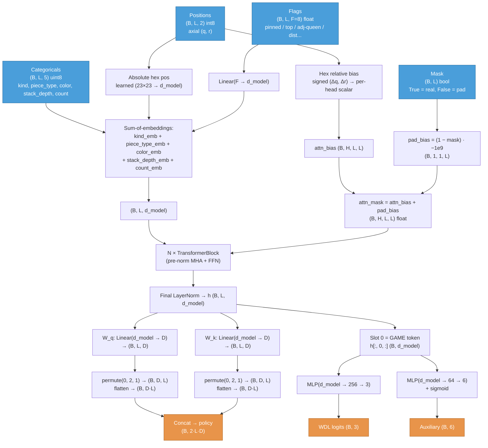

# HiveTransformer Architecture

Token-based transformer that replaces the CNN-style `HiveNet` documented in
[`hive_model.md`](hive_model.md). The CNN encodes the 23×23 board as a fixed
`(B, 24, G, G)` tensor with 95% empty cells; the transformer encodes the
position by its actual entities — pieces, reserves, candidate destination
cells — and lets global self-attention capture the long-range interactions
(ant traversal, grasshopper jumps, queen pressure) that 3×3 convolutions can
only learn slowly.

## Data Flow



## Input

A Hive position is encoded as a **variable-length token sequence** padded to
`L = SEQ_LEN = 128`. Each token is one of four kinds; `kind=0` (`PAD`) means
the slot is unused and attention masks it out. Token feature constants live
in [`rust/crates/hive-game/src/tokenize.rs`](../rust/crates/hive-game/src/tokenize.rs)
and are mirrored in [`hive/nn/transformer.py`](../hive/nn/transformer.py).

### Token kinds

| `kind` | Meaning | Typical count |
|--------|---------|---------------|
| 0 | `PAD` — masked out | rest of L |
| 1 | `GAME` — CLS-style; value + aux heads read from slot 0 | always 1 |
| 2 | `PIECE` — top piece of an occupied board cell | 8–22 |
| 3 | `RESERVE` — one per `(color, base_type)` with count > 0 | 0–10 |
| 4 | `CELL` — candidate destination (any hex appearing as `to` in a legal move) | 20–50 |

Slot order is fixed: `[GAME] [PIECE…] [RESERVE…] [CELL…] [PAD…]`. The
transformer is position-equivariant via positional encodings, so slot order
inside each section doesn't matter — but pinning `GAME` to slot 0 lets
non-token heads read `h[:, 0, :]` without indexing.

### Per-token fields

| Tensor | Shape | Dtype | Content |
|--------|-------|-------|---------|
| `categoricals` | `(B, L, 5)` | uint8 / int64 | per slot: `[kind, piece_type, color, stack_depth, count]` |
| `positions` | `(B, L, 2)` | int8 / int64 | axial `(q, r)`; defined for `PIECE` and `CELL`, ignored elsewhere |
| `flags` | `(B, L, F=8)` | float | continuous + binary flags (see below) |
| `mask` | `(B, L)` | bool | `True` for real tokens, `False` for pad |

The categorical fields are *current-player-relative*: `color=1` always means
"mine" regardless of which physical colour the player controls.

Field vocabularies:

| Field | Values |
|-------|--------|
| `kind` | 0=PAD, 1=GAME, 2=PIECE, 3=RESERVE, 4=CELL |
| `piece_type` | 0=NONE, 1=Queen, 2=Spider, 3=Beetle, 4=Grasshopper, 5=Ant |
| `color` | 0=NONE, 1=MINE, 2=OPP |
| `stack_depth` | 1..=7 for `PIECE` tokens (height of the stack), 0 otherwise |
| `count` | 1..=N reserve count for `RESERVE` tokens, 0 otherwise |

### Flag bundle (`F = 8`)

| Index | Flag |
|-------|------|
| 0 | `pinned` — single-stack piece is an articulation point of the hive |
| 1 | `top_of_stack` — only the top piece of a stack can move |
| 2 | `adj_my_queen` — token is adjacent to current player's queen |
| 3 | `adj_opp_queen` — token is adjacent to opponent's queen |
| 4 | `on_frontier` — `CELL` token is empty + adjacent to the hive (placement candidate) |
| 5 | `dist_my_queen` — normalised hex distance to mine, saturated at 1.0 past distance 6 |
| 6 | `dist_opp_queen` — same, for opponent |
| 7 | reserved (also used as "my queen placed" bit on the `GAME` token) |

## Embedding layer

```
x = kind_emb[kind] + piece_type_emb[piece_type] + color_emb[color]
  + stack_depth_emb[stack_depth] + count_emb[count]
  + abs_pos[q + 11, r + 11]   ← masked to (kind ∈ {PIECE, CELL}) so non-positional
                                 tokens contribute zero from this term
  + flag_proj(flags)           ← Linear(F=8 → d_model)
```

Sum-of-embeddings (BERT-style). Each categorical field has its own embedding
table of size `(vocab, d_model)`. The absolute position lookup is a single
`(23·23, d_model) = (529, d_model)` table indexed by `(q + 11, r + 11)` —
trivial parameter count compared to the trunk.

## Trunk

`N` pre-norm transformer blocks (`LayerNorm → MHA → +residual ; LayerNorm →
FFN → +residual`), all sharing **one** runtime-computed attention bias.

```
TransformerBlock × N
  LayerNorm
  QKV = Linear(d_model → 3·d_model);  reshape → (B, H, L, head_dim) for each
  attn_out = SDPA(q, k, v, attn_mask=attn_mask, scale = 1/√head_dim)
  out_proj = Linear(d_model → d_model);  residual

  LayerNorm
  FFN: Linear(d_model → ffn_mult·d_model) → GELU → Linear(ffn_mult·d_model → d_model);  residual
```

Two critical implementation details that keep the exported ONNX graph
**fully on CUDA** (see commit history for the diagnostic; pre-fix versions
added 8 Memcpy nodes — one per block — that dragged GPU utilisation):

1. The pad-key mask is composed **once at the model entry** as pure float:
   `mask_f = mask.to(attn_bias.dtype)`,
   `pad_bias = (1 − mask_f) · −1e9`,
   `attn_mask = attn_bias + pad_bias`. No bool ops flow through per-block
   code, so CUDA EP doesn't fall back to CPU for missing bool kernels.
2. SDPA receives an explicit `scale = 1/√head_dim` constant. Without it the
   exporter emits a runtime `Slice → Cast(fp16) → Sqrt → Cast(fp32) → Div`
   chain per block whose fp32 detour pulls a host↔device Memcpy each way.

### Hex relative bias

```
HexRelativeBias
  table: nn.Parameter(num_heads, 2L−1, 2L−1)    ← signed (Δq, Δr) lookup, zero-init
  null_bias: nn.Parameter(num_heads)            ← shared scalar for non-positional pairs

  forward(q, r, positional):
    Δq = q[:, :, None] − q[:, None, :]
    Δr = r[:, :, None] − r[:, None, :]
    bias[b, h, i, j] = table[h, Δq + 22, Δr + 22]
    bias = where(positional[i] & positional[j], bias, null_bias)
    return bias  # (B, H, L, L)
```

This is the single most important architectural choice for hex board games:
hex geometry is baked into attention without the model needing to learn
"adjacent tokens should attend strongly" from scratch. Direction enters via
the signed `(Δq, Δr)` lookup; hex distance is implicitly captured because
the same `(Δq, Δr)` bin corresponds to one hex-vector regardless of where
the pair sits on the board. Both `table` and `null_bias` are zero-initialised
so the trunk starts as identity wrt the bias and learns geometry from data.

Total bias params: `num_heads · (2L−1)² + num_heads` ≈ 8 k at the defaults.

## Output heads

### Policy: bilinear Q·K over token pairs

```
h = final_norm(trunk_output)           # (B, L, d_model)
q_emb = W_q(h)                         # (B, L, D)
k_emb = W_k(h)                         # (B, L, D)
q_flat = q_emb.permute(0, 2, 1).flatten(1)   # (B, D·L) — D-major
k_flat = k_emb.permute(0, 2, 1).flatten(1)   # (B, D·L) — D-major
policy = cat([q_flat, k_flat], dim=1)        # (B, 2·L·D)
```

Per-move prior in MCTS:
```
logit(move m = (mover_slot, dest_slot)) = (Q[mover_slot] · K[dest_slot]) / √D
```

This is exactly what `core_game::game::PolicyIndex::DotProduct` already
reads when `g2 = L` and `embed_dim = D`, so the existing MCTS expansion
code consumes the token output unchanged (the same enum used to read the
CNN's bilinear movement head). Placements and movements are **unified**: a
placement is just a `(RESERVE_token, CELL_token)` pair, scored by the same
bilinear formula. No separate placement head.

The Rust tokenizer emits each legal move as
```
PolicyIndex::DotProduct {
    q_offset: 0,
    k_offset: L · D,
    src_cell: mover_slot,
    dst_cell: dest_slot,
    embed_dim: D,
    g2: L,
}
```

#### Policy layout (flat vector of size `2·L·D`)

| Range | Section | Indexing |
|-------|---------|----------|
| `[0 .. L·D)` | Q embeddings | `policy[d · L + token_slot]` for `d ∈ [0, D)` |
| `[L·D .. 2·L·D)` | K embeddings | `policy[L·D + d · L + token_slot]` for `d ∈ [0, D)` |

Both sections are **D-major** — the same convention the CNN policy head uses.

#### Policy loss

A single soft cross-entropy over the union of legal `(mover, dest)` pairs at
each position. Per-pair logits are `Q[mover] · K[dest] / √D`; padded slots
in the training buffer's `(B, K)` move arrays drop out via the
`arange < num_moves` mask before softmax. No separate placement loss.

### Value: WDL from the `[GAME]` token

```
h_game = h[:, 0, :]                          # (B, d_model)
wdl_logits = Linear(d_model → 256) → GELU → Linear(256 → 3)
```

Raw WDL logits. Training uses `log_softmax`; the ONNX export wrapper
softmaxes before export so Rust/ORT consumers see probabilities. Contempt is
applied Rust-side as `W − L − contempt · D`. Scalar value targets
`v ∈ [−1, 1]` map to WDL distributions via the same `_scalar_to_wdl` helper
as the CNN (see [`hive/nn/training.py`](../hive/nn/training.py)).

### Auxiliary: six game-metrics from the `[GAME]` token

```
h_game = h[:, 0, :]
aux = Linear(d_model → 64) → GELU → Linear(64 → 6) → sigmoid
```

Same six signals the CNN aux head produced, in the same order — see
[`hive_model.md`](hive_model.md#auxiliary-head) for target definitions.
MSE loss, pair-grouped: `qd_loss + qe_loss + mob_loss`. Always active.

Note the CNN had **two extra per-cell aux heads** (`src_logits` for the
source-marginal of the movement target and `legal_place_logits` for the
binary legality mask). Both were grid-shaped scaffolding for the CNN
movement head and don't apply to tokens — the model is already trained on
the joint `(mover, dest)` distribution directly. They were dropped in the
token rewrite.

## Total loss

```
loss = policy_loss + value_loss_scale · value_loss + aux_loss_scale · aux_loss
```

Both scales default to 1.0 and are CLI-tunable
(`--value-loss-scale`, `--aux-loss-scale`).

## D6 symmetry augmentation

Hive has 12-fold D6 hex symmetry (6 rotations × 2 reflections). The CNN
trainer applied D6 by permuting the per-cell channels of the `(C, G, G)`
board tensor and remapping the per-cell policy targets — a substantial
piece of fancy-index machinery.

For the token transformer it collapses to **permuting per-token `(q, r)`
positions**:

```
new_pos = einsum("bij,blj->bli", axial_transforms[sym_idx], pos)
```

The token *identity* and the policy target are invariant under augmentation —
only the spatial coordinates change. The 12 axial-transform matrices come
from `engine_zero.d6_axial_transforms()` (Rust-side `D6Symmetry::all()`),
materialised once on GPU at the first batch and reused. See
[`hive/nn/training.py`](../hive/nn/training.py)'s `_apply_sym_gpu`.

## Training config

| Parameter | Value |
|-----------|-------|
| Optimizer | SGD + momentum 0.9 |
| Learning rate | 0.02 constant (tunable via `--lr`) |
| Epochs per generation | 1 |
| Default model | `d_model=128, num_heads=4, n_blocks=8, ffn_mult=4, D=64` |
| `SEQ_LEN` | 128 (pad cap; mid-game uses 40–80) |
| `BILINEAR_DIM` | 64 |
| Symmetry augmentation | D6 (12 transforms), on by default |
| Playout cap randomization | Not yet ported from CNN trainer |

## Default model

The defaults baked into `create_model({})` come out to **~1.73 M
parameters**, broken down approximately:

| Block | Params | Notes |
|-------|--------|-------|
| Categorical embeddings (5 tables) | ~4.4 k | 5 + 6 + 3 + 8 + 12 = 34 rows × 128 |
| Absolute position lookup | ~67.7 k | 23 × 23 = 529 rows × 128 |
| Flag projection `Linear(8 → 128)` | ~1.2 k |
| Relative bias table | ~8 k | 4 heads × 45² + 4 |
| **Transformer trunk (8 blocks)** | **~1.59 M** | ~198 k per block: QKV `4d²` + FFN `2·d·4d` |
| Final `LayerNorm` | 0.3 k |
| Policy Q+K `Linear(128 → 64)` × 2 | ~16.5 k |
| Value MLP `128 → 256 → 3` | ~33.8 k |
| Aux MLP `128 → 64 → 6` | ~8.6 k |
| **Total** | **≈ 1.73 M** | vs CNN `medium` ≈ 3.7 M |

Per-block cost scales as `12·d_model²` (4d² for QKV + out_proj, 8d² for the
two-layer FFN at `ffn_mult=4`). Doubling `d_model` to 256 quadruples per-block
params; doubling `n_blocks` to 16 doubles the trunk. Both directions are
fair game once the architecture proves itself in self-play.

## Inference contract

The Python model and Rust engine agree on:

```python
eval_fn(
    categoricals: np.ndarray[B, L, 5]  uint8,
    positions:    np.ndarray[B, L, 2]  int8,
    flags:        np.ndarray[B, L, F]  float32,
    mask:         np.ndarray[B, L]     bool,
) -> (
    policy: np.ndarray[B, 2·L·D]       float32,   # [Q || K] D-major
    wdl:    np.ndarray[B, 3]           float32,
    aux:    np.ndarray[B, 6]           float32,
)
```

The same shapes are exposed by the ONNX export
(input names: `categoricals`, `positions`, `flags`, `mask`;
output names: `policy`, `wdl`, `aux`) and consumed by the Rust
`HiveTokenOrtEngine` for ORT-driven self-play. See
[`hive/nn/transformer.py`](../hive/nn/transformer.py)'s `export_onnx`.
