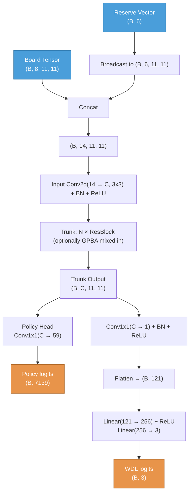

# YinshNet Architecture

## Data Flow



## Input

### Board tensor: `(B, 8, 11, 11)`
8 spatial channels on an 11×11 grid (85 valid YINSH cells out of 121). Cell `(col, row)` maps to grid position `row * 11 + col`. All channels are current-player-relative.

| Channel | Content |
|---------|---------|
| 0 | My rings |
| 1 | Opponent rings |
| 2 | My markers |
| 3 | Opponent markers |
| 4 | Valid cell mask (1.0 on the 85 board cells) |
| 5 | Phase flag — Setup (broadcast on valid cells) |
| 6 | Phase flag — Normal |
| 7 | Phase flag — ClaimRow (joint row + ring removal pending) |

### Reserve vector: `(B, 6)`

| Index | Content | Normalization |
|-------|---------|---------------|
| 0 | Markers in pool | / 51 |
| 1 | My score (rings claimed) | / 3 |
| 2 | Opponent score | / 3 |
| 3 | My rings on board | / 5 |
| 4 | Opponent rings on board | / 5 |
| 5 | Total rings placed (setup progress) | / 10 |

## Trunk

Reserve vector is broadcast spatially and concatenated with the board tensor before the trunk: `(B, 8, 11, 11)` + `(B, 6, 11, 11)` → `(B, 14, 11, 11)`.

```
Input Conv2d(14 → C, 3x3, pad=1) + BN + ReLU
  ↓
trunk_spec sequence:
  "res"  → ResBlock(C)
  "gpba" → GlobalPoolBias(C) (KataGo-style global context injection)
```

Default model config: **C=96, trunk = 8×res**.

## Policy Head (single conv1x1, 59 channels)

```
Conv2d(C → 59, 1x1) → flatten → (B, 7139)
```

Channel layout (all on the 11×11 grid, 49 cells valid):

| Channel(s) | Content | Phase | PolicyIndex |
|------------|---------|-------|-------------|
| 0          | PlaceRing destination | Setup | `Single` |
| 1-3        | ClaimRow row start, dir 0/1/2 (joint partner A) | ClaimRow | `Sum(a, b)` (paired with ch 4) |
| 4          | ClaimRow ring target (joint partner B) | ClaimRow | (paired with ch 1-3) |
| 5-58       | MoveRing — channel = 5 + dir_idx × 9 + (dist−1), value at source cell | Normal | `Single` |

### Move prior computation (Rust MCTS)

- `PlaceRing(at)`: `policy[ch_place_ring, at]`
- `MoveRing(from → to)`: `policy[5 + dir_idx × 9 + (dist−1), from]` where `dir_idx` ∈ 0..6 and `dist` ∈ 1..=9
- `ClaimRow(start, dir, ring)`: `policy[1 + dir, start] + policy[4, ring]` — properly joint over (row, ring)

### ClaimRow as a single MCTS decision

After a ring move that completes one or more 5-marker rows, every claim is a single atomic MCTS step that picks both which row to remove (5 markers) and which of the player's rings to take off. Per yinsh rule G.3 these always come paired; making them one move halves the per-claim NN inference count and lets the network score (row, ring) jointly through the `Sum(row, ring)` prior. Multiple pending rows (intersecting rows or the opponent's deferred rows after own claims complete) remain separate ClaimRow turns — same-player consecutive turns are handled by MCTS backprop the same way as Zertz mid-captures.

### Symmetry augmentation

D6 hex symmetry that maps every valid Yinsh cell to another valid cell (subset of the 12 D6 transforms — see `yinsh_valid_d6_indices`). Spatial gather is applied to all channels; two channel groups also need a direction permutation:
- ClaimRow row channels (1-3): row direction permutation (`yinsh_d6_dir_permutations`)
- MoveRing channels (5-58): movement direction permutation (`yinsh_d6_movement_dir_permutations`)

The PlaceRing channel (0) and the ClaimRow ring channel (4) need only the spatial gather.

### Policy loss

Soft cross-entropy over the legal-move distribution. For ClaimRow's `Sum(a, b)` prior, MCTS visit probability for each chain is split 50/50 between the two factor cells when projecting to the per-cell training target (marginal CE). Within a node, every legal ClaimRow has exactly two summed logits, so the marginal-CE bias is uniform across all ClaimRow moves and the relative ranking is preserved — the absolute logit scale shifts but the softmax over legal moves is unaffected.

## Value Head (WDL)

```
Conv2d(C → 1, 1x1) + BN + ReLU         → (B, 1, 11, 11)
Flatten                                → (B, 121)
Linear(121 → 256) + ReLU               → (B, 256)
Linear(256 → 3) (raw logits)           → (B, 3)
```

Outputs raw (Win, Draw, Loss) logits; callers apply softmax. Inference (ONNX export) returns probabilities.

### Value loss
Soft cross-entropy on WDL targets derived from the scalar value target `v ∈ [-1, 1]`:
- `W = max(v, 0)`, `L = max(-v, 0)`, `D = 1 - W - L`

## Total Loss
```
loss = policy_loss + value_loss_scale * value_loss
```
Default `value_loss_scale = 1.0`.

## Training Config

| Parameter | Value |
|-----------|-------|
| Optimizer | SGD + momentum 0.9 |
| Learning rate | 0.02 (constant) |
| Epochs per iteration | 1 |
| Buffer size | 100,000 positions |
| c_puct | 1.5 |
| Playout cap randomization | Yes (KataGo-style) |
| Empirical max moves per game | 86 (after ClaimRow consolidation) |

## Move Notation

| Move | Format | Example |
|------|--------|---------|
| PlaceRing | `<cell>` | `E5` |
| MoveRing | `<from> <to>` | `E5 E8` |
| ClaimRow | `Claim <5 row cells> <ring>` | `Claim E5 E6 E7 E8 E9 D3` |
| Pass | `Pass` | `Pass` |
