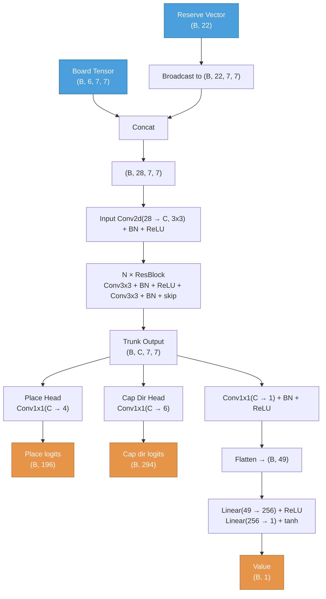

# ZertzNet Architecture

## Data Flow



## Input

Tensor dimensions use `(B, ...)` notation where B = batch size.

### Board tensor: `(B, 6, 7, 7)`
6 spatial channels on a 7x7 grid (radius-3 hex board, 37 valid cells out of 49; rows 4-5-6-7-6-5-4 left-aligned).

| Channel | Content |
|---------|---------|
| 0 | White marbles (1.0 where present) |
| 1 | Grey marbles |
| 2 | Black marbles |
| 3 | Empty rings (valid cell, no marble) |
| 4 | Capture turn flag (1.0 on all cells if first-hop capture or mid-capture) |
| 5 | Mid-capture source (1.0 at the active marble's position during mid-capture) |

Removed rings and off-board cells are all zeros. Channels 4-5 are zero during placement turns.

### Reserve vector: `(B, 22)`
All values normalized to [0, 1]. Current-player-relative.

| Index | Content | Normalization |
|-------|---------|---------------|
| 0-2 | Supply (W, G, B) — marbles not yet on the board | / initial supply (6, 8, 10) |
| 3-5 | Current player captures (W, G, B) | / initial supply |
| 6-8 | Opponent captures (W, G, B) | / initial supply |
| 9-11 | Current player combo win progress (W, G, B) | min(captures, 3) / 3 |
| 12-14 | Opponent combo win progress (W, G, B) | min(captures, 3) / 3 |
| 15-17 | Current player single-color win progress (W, G, B) | cap / threshold (4, 5, 6) |
| 18-20 | Opponent single-color win progress (W, G, B) | cap / threshold (4, 5, 6) |
| 21 | Rings remaining on board | / 37 |

## Trunk

Reserve vector is broadcast spatially and concatenated with the board tensor before the trunk:
`(B, 6, 7, 7)` + `(B, 22, 7, 7)` → `(B, 28, 7, 7)`

```
Input Conv2d(28 → C, 3x3, pad=1) + BN + ReLU
  ↓
N × ResBlock:
  Conv2d(C → C, 3x3, pad=1) + BN + ReLU
  Conv2d(C → C, 3x3, pad=1) + BN
  + skip connection + ReLU
```
Output: `(B, C, 7, 7)`

Default model config: **C=64, N=6** (6 residual blocks, 64 channels)

## Policy Heads (2 conv1x1 heads)

Both heads operate directly on the trunk output.

| Head | Conv2d | Output | Purpose |
|------|--------|--------|---------|
| **Place** | `(C → 4, 1x1)` | `(B, 196)` | ch 0-2: place White/Grey/Black ball, ch 3: remove ring |
| **Cap Dir** | `(C → 6, 1x1)` | `(B, 294)` | one channel per hex direction (E=0, NE=1, NW=2, W=3, SW=4, SE=5); logit at source cell |

### Move prior computation (Rust MCTS)
Scores are sums of head logits per move type, then softmax over legal moves:
- `Place(color, pos, remove)`: `place[color, pos] + place[3, remove]`
- `PlaceOnly(color, pos)`: `place[color, pos]`
- `Capture(from, dir)`: `cap_dir[dir, from]` (direction of the 2-cell jump)
- Mid-capture continuation: `cap_dir[dir, from]` (same — only first jump of chain is scored)

### Symmetry augmentation
D6 symmetry requires permuting both spatial positions and direction channels for the cap_dir head. Direction channel `d` maps to `sym.transform_dir(d)` under each of the 12 D6 symmetries.

### Policy loss
Independent soft cross-entropy per head (place, cap_dir). Mid-capture turns only train the cap_dir head.

## Value Head

Operates directly on the trunk output (reserve info already in trunk via input).

```
Conv2d(C → 1, 1x1) + BN + ReLU           → (B, 1, 7, 7)
Flatten                                  → (B, 49)
Linear(49 → 256) + ReLU                  → (B, 256)
Linear(256 → 1) + tanh                   → (B, 1)
```
Output range: `[-1, 1]`

### Value loss
MSE: `(predicted - target)^2`

## Total Loss
```
loss = policy_loss + 1.0 * value_loss
```

## Training Config
| Parameter | Value |
|-----------|-------|
| Optimizer | SGD + momentum 0.9 |
| Learning rate | 0.02 (constant) |
| Epochs per iteration | 1 |
| Simulations | 1200 |
| Buffer size | 32,000 positions |
| c_puct | 1.5 |
| Playout cap randomization | Yes (KataGo-style) |

## Parameter Count (C=64, N=6)
- Input conv: 28 × 64 × 3 × 3 = 16,128 + BN(64) = 16,256
- Per ResBlock: 2 × (64 × 64 × 3 × 3) + BN ≈ 73,984 → 6 blocks = 443,904
- Policy place: 64 × 4 + 4 = 260
- Policy cap_dir: 64 × 6 + 6 = 390
- Value head: Conv(64→1) + BN(1) + Linear(49→256) + Linear(256→1) ≈ 13,123
- **Total: ~474K parameters**

For C=128, N=4 (larger training config): ~1.2M parameters.

## Training data storage
The flat `POLICY_SIZE = 4440` format is used only for storing MCTS visit distributions, **not** as NN output:
- `[0, 4107)`: Place — `color * 37² + place_at * 37 + remove`
- `[4107, 4218)`: PlaceOnly — `4107 + color * 37 + place_at`
- `[4218, 4440)`: Capture — `4218 + direction * 37 + from`

Visit distributions in this flat format are marginalized at training time into per-head targets (`place` and `cap_dir`).
