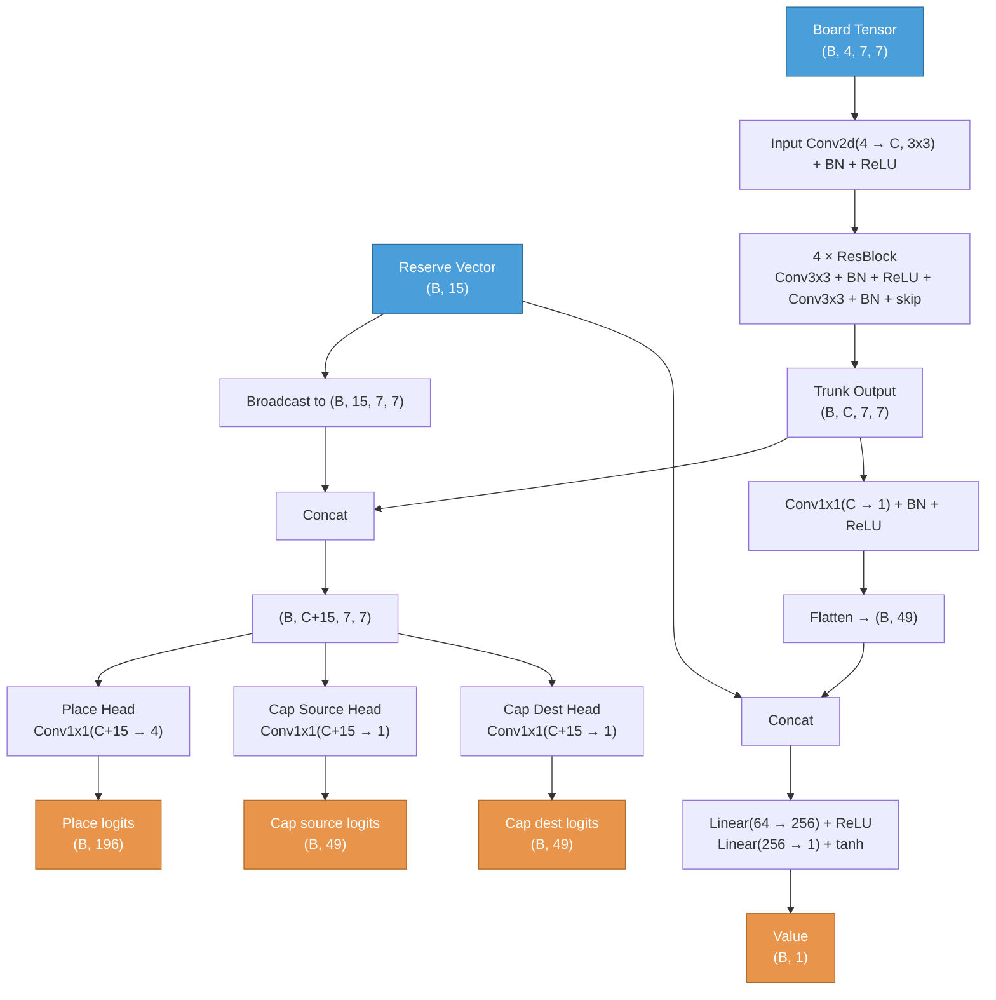

# ZertzNet Architecture

## Data Flow



## Input

Tensor dimensions use `(B, ...)` notation where B = batch size.

### Board tensor: `(B, 4, 7, 7)`
4 spatial channels on a 7x7 grid (radius-3 hex board, 37 valid cells out of 49; rows 4-5-6-7-6-5-4 left-aligned).

| Channel | Content |
|---------|---------|
| 0 | White marbles (1.0 where present) |
| 1 | Grey marbles |
| 2 | Black marbles |
| 3 | Empty rings (valid cell, no marble) |

Removed rings and off-board cells are all zeros.

### Reserve vector: `(B, 15)`
All values normalized to [0, 1]. Current-player-relative.

| Index | Content | Normalization |
|-------|---------|---------------|
| 0-2 | Supply (W, G, B) — marbles not yet on the board | / initial supply (6, 8, 10) |
| 3-5 | Current player captures (W, G, B) | / initial supply |
| 6-8 | Opponent captures (W, G, B) | / initial supply |
| 9-11 | Current player combo win progress (W, G, B) | min(captures, 3) / 3 |
| 12-14 | Opponent combo win progress (W, G, B) | min(captures, 3) / 3 |

## Trunk
```
Input Conv2d(4 → C, 3x3, pad=1) + BN + ReLU
  ↓
N × ResBlock:
  Conv2d(C → C, 3x3, pad=1) + BN + ReLU
  Conv2d(C → C, 3x3, pad=1) + BN
  + skip connection + ReLU
```
Output: `(B, C, 7, 7)`

Current training config: **C=128, N=4** (4 residual blocks, 128 channels)

## Policy Heads (3 conv1x1 heads)

Reserve vector is broadcast to spatial dims and concatenated with trunk: `(B, C+15, 7, 7)`

| Head | Conv2d | Output | Purpose |
|------|--------|--------|---------|
| **Place** | `(C+15 → 4, 1x1)` | `(B, 196)` | ch 0-2: place White/Grey/Black ball, ch 3: remove ring |
| **Cap Source** | `(C+15 → 1, 1x1)` | `(B, 49)` | which marble starts a capture hop |
| **Cap Dest** | `(C+15 → 1, 1x1)` | `(B, 49)` | where the marble lands |

### Move prior computation (Rust MCTS)
Scores are sums of head logits per move type, then softmax over legal moves:
- `Place(color, pos, remove)`: `place[color, pos] + place[3, remove]`
- `PlaceOnly(color, pos)`: `place[color, pos]`
- `Capture(from, to)`: `cap_source[from] + cap_dest[to]`
- Mid-capture continuation: `cap_dest[to]` only

### Policy loss
Independent cross-entropy per head. Mid-capture turns only train cap_dest.

## Value Head
```
Conv2d(C → 1, 1x1) + BN + ReLU            → (B, 1, 7, 7)
Flatten                                   → (B, 49)
Concat reserve                            → (B, 64)
Linear(64 → 256) + ReLU                   → (B, 256)
Linear(256 → 1) + tanh                    → (B, 1)
```
Output range: `[-1, 1]`

### Value loss
MSE: `(predicted - target)^2`, weighted 5x in total loss.

## Total Loss
```
loss = policy_loss + 5.0 * value_loss
```

## Training Config
| Parameter | Value |
|-----------|-------|
| Optimizer | SGD + momentum 0.9 |
| Learning rate | 0.02 (constant) |
| Epochs per iteration | 1 |
| Simulations | 1200 |
| Buffer size | 32,000 positions |
| c_puct | 1.5 |
| Playout cap randomization | Yes (KataGo-style) |

## Parameter Count (C=128, N=4)
- Input conv: 4 × 128 × 3 × 3 = 4,608
- Per ResBlock: 2 × (128 × 128 × 3 × 3) = 294,912 → 4 blocks = 1,179,648
- BatchNorm (trunk): (128 × 2) × (4+1) = 1,280
- Policy heads: 3 × conv1x1 from 143 channels = 143×4 + 143×1 + 143×1 + biases = 858 + 6 = 864
- Value head: 128×1×1 + 64×256 + 256×1 + BN = 128 + 16,384 + 256 + 2 = 16,770
- **Total: ~1.2M parameters**
