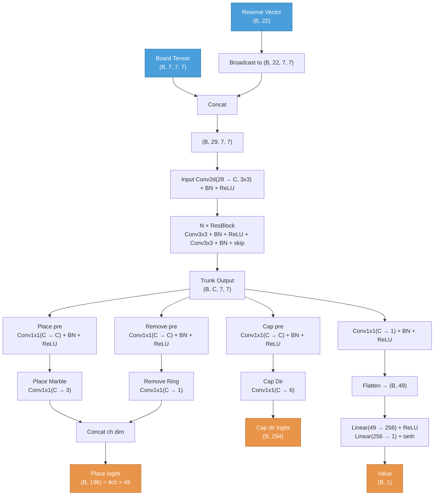

# ZertzNet Architecture

## Data Flow


```mermaid
graph TD
    BT["Board Tensor<br/>(B, 7, 7, 7)"]:::input --> CAT["Concat"]
    RV["Reserve Vector<br/>(B, 22)"]:::input --> BC["Broadcast to (B, 22, 7, 7)"]
    BC --> CAT
    CAT --> INPUT["(B, 29, 7, 7)"]

    INPUT --> IC["Input Conv2d(29 → C, 3x3) + BN + ReLU"]
    IC --> RB["N × ResBlock<br/>Conv3x3 + BN + ReLU + Conv3x3 + BN + skip"]
    RB --> TRUNK["Trunk Output<br/>(B, C, 7, 7)"]

    TRUNK --> PLACE_PRE["Place pre<br/>Conv1x1(C → C) + BN + ReLU"]
    TRUNK --> REMOVE_PRE["Remove pre<br/>Conv1x1(C → C) + BN + ReLU"]
    TRUNK --> CAP_PRE["Cap pre<br/>Conv1x1(C → C) + BN + ReLU"]

    PLACE_PRE --> PH_PLACE_M["Place Marble<br/>Conv1x1(C → 3)"]
    REMOVE_PRE --> PH_REMOVE["Remove Ring<br/>Conv1x1(C → 1)"]
    CAP_PRE --> PH_CAP["Cap Dir<br/>Conv1x1(C → 6)"]

    PH_PLACE_M --> PCAT["Concat ch dim"]
    PH_REMOVE --> PCAT
    PCAT --> PO_PLACE["Place logits<br/>(B, 196) = 4ch × 49"]:::output
    PH_CAP --> PO_CAP["Cap dir logits<br/>(B, 294)"]:::output

    TRUNK --> VC["Conv1x1(C → 1) + BN + ReLU"]
    VC --> VF["Flatten → (B, 49)"]
    VF --> VFC["Linear(49 → 256) + ReLU<br/>Linear(256 → 1) + tanh"]
    VFC --> VOUT["Value<br/>(B, 1)"]:::output

    classDef input fill:#4a9eda,stroke:#2a6fa0,color:#fff
    classDef output fill:#e8944a,stroke:#b06a2a,color:#fff
```

## Input

Tensor dimensions use `(B, ...)` notation where B = batch size.

### Board tensor: `(B, 7, 7, 7)`
7 spatial channels on a 7x7 grid (radius-3 hex board, 37 valid cells out of 49; rows 4-5-6-7-6-5-4 left-aligned).

| Channel | Content |
|---------|---------|
| 0 | White marbles (1.0 where present) |
| 1 | Grey marbles |
| 2 | Black marbles |
| 3 | Empty rings (valid cell, no marble) |
| 4 | Capture turn flag (1.0 on all cells if first-hop capture or mid-capture) |
| 5 | Mid-capture source (1.0 at the active marble's position during mid-capture) |
| 6 | Mid-placement flag (1.0 on all cells when a marble has been placed via `PlaceMarbleHalf` but the matching `RemoveRingHalf` has not yet been applied — legal moves restricted to ring removals) |

Removed rings and off-board cells are all zeros. Channels 4-6 are zero during plain placement turns. Channels 4-5 light up on capture turns, channel 6 lights up on the mid-placement (ring-removal) half-turn.

### Reserve vector: `(B, 22)`
All values normalized to [0, 1]. Current-player-relative.

| Index | Content | Normalization |
|-------|---------|---------------|
| 0-2 | Supply (W, G, B) — marbles not yet on the board | / initial supply (6, 8, 10) |
| 3-5 | Current player captures (W, G, B) | / initial supply |
| 6-8 | Opponent captures (W, G, B) | / initial supply |
| 9-11 | Current player combo win progress (W, G, B) | min(captures, 3) / 3 |
| 12-14 | Opponent combo win progress (W, G, B) | min(captures, 3) / 3 |
| 15-17 | Current player single-color win progress (W, G, B) | cap / threshold (4, 5, 6) |
| 18-20 | Opponent single-color win progress (W, G, B) | cap / threshold (4, 5, 6) |
| 21 | Rings remaining on board | / 37 |

## Trunk

Reserve vector is broadcast spatially and concatenated with the board tensor before the trunk:
`(B, 7, 7, 7)` + `(B, 22, 7, 7)` → `(B, 29, 7, 7)`

```
Input Conv2d(29 → C, 3x3, pad=1) + BN + ReLU
  ↓
N × ResBlock:
  Conv2d(C → C, 3x3, pad=1) + BN + ReLU
  Conv2d(C → C, 3x3, pad=1) + BN
  + skip connection + ReLU
```
Output: `(B, C, 7, 7)`

Default model config: **C=64, N=6** (6 residual blocks, 64 channels)

## Policy Heads (3 per-head pre-projections + final conv1x1)

Each policy head gets its own per-cell MLP — `Conv1×1(C → C) + BN + ReLU` — before its final projection conv. Marble placement, ring removal, and capture-direction are three independent MCTS decision types after the split-ply refactor, so giving each its own pre-projection lets them specialise instead of fighting over a shared layer (mirrors Hive's place/Q/K pattern). The marble-placement (3ch) and ring-removal (1ch) projections concatenate to reproduce the existing 4-channel `place_logits` block so the Rust contract is unchanged.

| Head | Pre-projection | Final conv | Output cells | Purpose |
|------|----------------|------------|--------------|---------|
| **Place Marble** | `Conv1×1(C → C) + BN + ReLU` | `Conv1×1(C → 3)` | ch 0-2 of place_logits | place White/Grey/Black marble at cell |
| **Remove Ring** | `Conv1×1(C → C) + BN + ReLU` | `Conv1×1(C → 1)` | ch 3 of place_logits | remove ring at cell |
| **Cap Dir** | `Conv1×1(C → C) + BN + ReLU` | `Conv1×1(C → 6)` | `(B, 294)` | one channel per hex direction (E=0, NE=1, NW=2, W=3, SW=4, SE=5); logit at source cell |

The marble + remove outputs concatenate (channel dim) to `place_logits: (B, 196)`. Cap dir flattens to `cap_dir_logits: (B, 294)`.

### Move prior computation (Rust MCTS)

Each MCTS decision point is a single move type (the split-ply state machine makes marble placement and ring removal separate decisions). Priors are read out as a single `PolicyIndex::Single` per legal move and softmaxed over the legal set:

- `PlaceMarbleHalf(color, pos)`: `place_logits[color, pos]`   (ch 0-2 of the place block)
- `RemoveRingHalf(remove)`: `place_logits[3, remove]`         (ch 3 of the place block)
- `PlaceOnly(color, pos)`: `place_logits[color, pos]`         (terminal placement: no removable ring remains after placing)
- `Capture(from, dir)`: `cap_dir_logits[dir, from]`           (direction of the 2-cell jump)
- Mid-capture continuation: `cap_dir_logits[dir, from]`       (same — only first jump of chain is scored)

The legacy joint `Place(color, pos, remove)` move is still applicable via `apply_move` (used by SGF replay and alpha-beta) and would map to a `Sum(place[color, pos], place[3, remove])` prior — but the split-ply MCTS never emits it.

### Symmetry augmentation
D6 symmetry requires permuting both spatial positions and direction channels for the cap_dir head. Direction channel `d` maps to `sym.transform_dir(d)` under each of the 12 D6 symmetries.

### Policy loss
Independent soft cross-entropy per head. Within a single MCTS turn the visit distribution lives on exactly one of the per-cell channel groups (marble W/G/B, remove, or one of six cap directions), so the per-head zero-sum check in the training loop selects the right loss term automatically:
- `PlaceMarbleHalf` / `PlaceOnly` turn → cross-entropy on place_logits ch 0-2 (marble position).
- `RemoveRingHalf` (mid-placement) turn → cross-entropy on place_logits ch 3 (remove).
- Capture turn (first-hop + mid-capture, treated identically) → cross-entropy on cap_dir_logits.

## Value Head

Operates directly on the trunk output (reserve info already in trunk via input).

```
Conv2d(C → 1, 1x1) + BN + ReLU           → (B, 1, 7, 7)
Flatten                                  → (B, 49)
Linear(49 → 256) + ReLU                  → (B, 256)
Linear(256 → 1) + tanh                   → (B, 1)
```
Output range: `[-1, 1]`

### Value loss
MSE: `(predicted - target)^2`

## Total Loss
```
loss = policy_loss + 1.0 * value_loss
```

## Training Config
| Parameter | Value |
|-----------|-------|
| Optimizer | SGD + momentum 0.9 |
| Learning rate | 0.02 (constant) |
| Epochs per iteration | 1 |
| Simulations | 1200 |
| Buffer size | 32,000 positions |
| c_puct | 1.5 |
| Playout cap randomization | Yes (KataGo-style) |

## Parameter Count (C=64, N=6)
- Input conv: 29 × 64 × 3 × 3 = 16,704 + BN(64) = 16,832
- Per ResBlock: 2 × (64 × 64 × 3 × 3) + BN ≈ 73,984 → 6 blocks = 443,904
- 3× policy pre-conv: 3 × (64 × 64 × 1 × 1 + BN(64)) = 3 × (4,096 + 128) ≈ 12,672
- Policy place_marble: 64 × 3 + 3 = 195
- Policy remove_ring:  64 × 1 + 1 = 65
- Policy cap_dir:      64 × 6 + 6 = 390
- Value head: Conv(64→1) + BN(1) + Linear(49→256) + Linear(256→1) ≈ 13,123
- **Total: ~487K parameters**

For C=128, N=4 (larger training config): ~1.2M parameters.

## Training data storage
MCTS visit distributions are stored in the same flat layout as the NN policy output: `NN_POLICY_SIZE = 490 = 10 × 49` floats per position, laid out as
- `[0, 49)`: place White at cell
- `[49, 98)`: place Grey at cell
- `[98, 147)`: place Black at cell
- `[147, 196)`: remove ring at cell
- `[196, 490)`: 6 cap_dir channels × 49 cells (E, NE, NW, W, SW, SE), value at source cell

Each MCTS decision is a single move type — its visit probabilities land on exactly one of the per-cell channel groups:
- `PlaceMarbleHalf(color, pos)` → one of `[0, 49)`, `[49, 98)`, `[98, 147)` depending on color.
- `RemoveRingHalf(remove)` → `[147, 196)`.
- `PlaceOnly(color, pos)` → same as `PlaceMarbleHalf` (terminal placement).
- `Capture(from, dir)` → one of the six `[196 + d·49, 196 + (d+1)·49)` blocks.

The legacy joint `Place(color, pos, remove)` move (used by SGF replay / alpha-beta, never emitted by split-ply MCTS) would marginalize to both the color/place cell and the remove-ring cell. The Python training loop slices the flat 490-dim target into per-head sub-targets and applies independent cross-entropy losses, with a per-target zero-sum check that selects only the active head for each sample.

A separate legacy flat `POLICY_SIZE = 4440` encoding (`color × 37² + place_at × 37 + remove` etc.) lives in `move_encoding::encode_move` and is **not** used for NN training — only for the dense move-to-index helper exposed by `get_legal_move_mask`.
